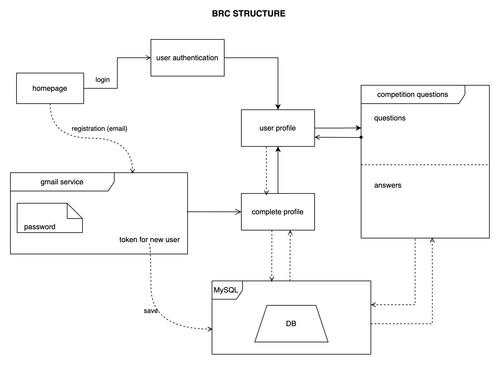

#### Über die Projekt
Die BRC Application ist ein Web App und da der Wettkampf der Buchlesen angezogen wird. Jeden Monat findet ein Wettkampf statt und jeder engagierte Junger oder afghanische Mädchen, der/die sich interessiert an das Buchlesen, kann teilnehmen. Am Ende des Monats findet dort eine Prüfung statt, wer den großen Markt erhalten hat, kann die berücksichtigte Prämie erwerben, wenn wir einen finanzielle Unterstützung haben. Die Prämie wird den meisten drei Personen vergeben. Dies ist auch so gesagt, dass am erste malen Teilnehmenden von einer Provinz oder solchen Bezirken rechnen werden.

Die App wird im Java Programmierung Sprache und Spring Boot entwickelt und die MySQL Datenbank wird zur Datei sparren benutzt. Natürlich wird die Hibernate zur Verbindung zwischen App logischer und Datenbank anstatt reiner SQL Query benutzt. In der View-Teile von dieser App wird die Thymeleaf Template Engine benutzt. Es funktioniert in zwei Sprachen, Englisch und Persisch, die mit geeigneten Benutzer verwendet werden.

#### Die Abläufe 
Auf dieser Webseite wird die Buchlesenwettkampf wahrscheinlich jeden Monat angezogen. Der Wettkampf legt die Voraussetzung auf, dass alle Teile eines berücksichtigten Buches oder dessen Teilen für die Teilnehmenden und Teilnehmender, die bis frisst Zeit lesen müssen und eine konkreten Eindruck darüber haben müssen. Am Ende dieser befristeten Zeit findet eine Prüfung statt, in der die Leserinnen und Leser berücksichtigt werden, wie Eindruck von diesem Buch sie haben und wie sie beeinflusst worden sind. Die Prüfung wird bei einem starken Team berücksichtigt, das Ergebnis wird nach der Entscheidung angezogen und alle Teilnehmenden werden durch E-mail mitgeteilt . Die Prämie wird persönlich für die Gewinnerin und den Gewinner gegeben. 

Um Teilnehmen an dieser Prüfung müssen sich die Teilnehmenden am ersten Anschauen von dieser Webseite registrieren, auf alle Regeln und Discipline achten und alle Instruktionen durchführen. Die Teilnehmenden können alle Lesenstoffe und die Einzelheit und mehr Informationen auf ihren Profil finden. Dort ist auch der Termin für die Prüfung vorhanden und sie müssen darauf achten. Man kann jeden malige Prüfung teilnehmen, es gibt keine Beschränkung. 

Hier gebe ich Informationen darüber, welche Aspekte in dieser Web App gemacht wurden.
- Buch Informationen stapeln:  Wie erwähnt, werden die Leserin und der Leser an einem Lesenwettkampf auf einem geeigneten Buch angemeldet. Deswegen werden viele Informationen über das Buch und manche Attributen, außerdem Fragen und Antworten aus dem Buch in der Datenbank gespart.
- Authentifizierung: Wenn jeder Benutzer sich in dieser App registrieren möchte, wird einen Nachricht an seine angegebene E-Mail geschickt und mit einem Klick auf die geschickte link in seiner E-Mail wird der Benutzer in das System bestätigt und aktiviert. 
- Login: Natürlich können die aktivierten Benutzer in der System login und ihrem Profil profitieren.  
Authorisation oder Genehmigung: Diese App hat zwei Teile, General Seiten und Private und Benutzerprofil Seiten. General Seiten werden für alle zugänglich und jeder kann diese Seiten ansehen und die privaten Teile sind nur zugänglich für die Benutzer nach der erfolgreichen Registrierung. 
- Fragen und Antworten: Während der Prüfung werden die Fragen auf die Teilnehmenden fristgemäßer angeschaut und mit ihren gegebenen Antworten bei die Teilnehmenden werden in der Datenbank gespart, um später beim Prüfer zu bewerten.
Dockerisierung und Hosting auf Amazon:

##### Liegengeblieben Werk:
- Localization and Internationalization
- Authentication und Authorization

